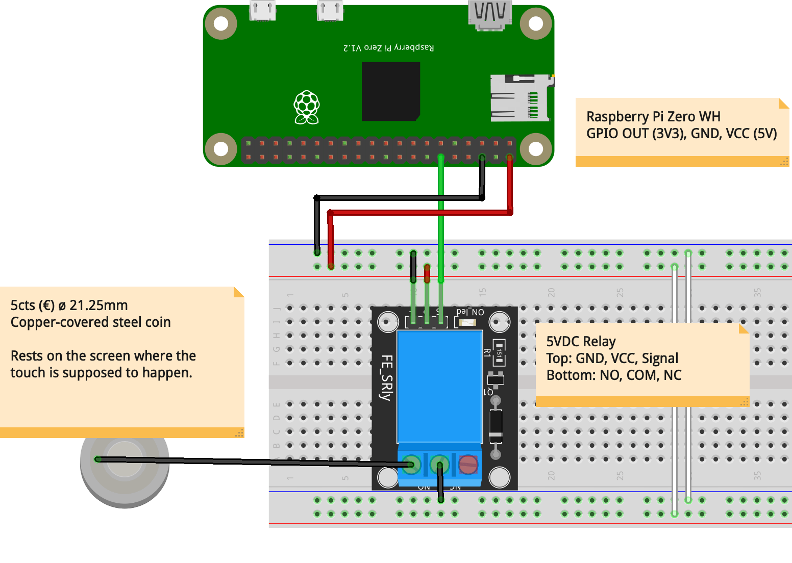

Raspberry Pi Cookie Clicker 2 Cheat
===================================

Cheating utility for Cookie Clicker 2 using a Raspberry Pi's GPIO interface.

<p align="center">
    <a href="#" target="_blank">
        
    </a>
</p>

🚀 Launch with:
```shell script
# ⚠️ will start right away on Pin #12 (board)
./cookieclicker.py
```

<p align="center">
    <a href="#" target="_blank">
        
    </a>
</p>
